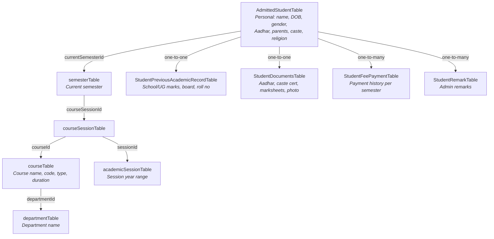

# Student Schema — Data Nesting & Full Detail Query

## Overview

`AdmittedStudentTable` is the **central hub** for all student data. Personal info lives on the row itself; academic and supporting data is reached through relations.

## Relationship Diagram



## Where Each Detail Lives

| What you need | Table | Relation from `AdmittedStudentTable` |
|---|---|---|
| **Personal info** (name, DOB, gender, parents, caste) | `AdmittedStudentTable` itself | Direct columns |
| **Current semester** | `semesterTable` | `currentSemesterId` → direct FK |
| **Course & Department** | `courseTable` → `departmentTable` | Nested: semester → courseSession → course → department |
| **Session year** | `academicSessionTable` | Nested: semester → courseSession → session |
| **Previous school/UG marks** | `StudentPreviousAcademicRecordTable` | `studentId` FK (one-to-one) |
| **Uploaded documents** | `StudentDocumentsTable` | `studentId` FK (one-to-one) |
| **Fee payments** | `StudentFeePaymentTable` | `studentId` FK (one-to-many) |
| **Remarks** | `StudentRemarkTable` | `studentId` FK (one-to-many) |

## Full Detail Query

Use this Drizzle relational query to fetch **all** student details in a single call:

```typescript
const student = await db.query.AdmittedStudentTable.findFirst({
  where: eq(AdmittedStudentTable.id, studentId),
  with: {
    // Academic position
    currentSemester: {
      with: {
        courseSession: {
          with: {
            course: {
              with: {
                department: true,   // ← department name
              },
            },
            session: true,          // ← session year
          },
        },
      },
    },
    // Previous education
    previousAcademicRecord: true,
    // Uploaded certificates
    documents: true,
    // All fee payments
    feePayments: true,
    // Admin remarks
    remarks: true,
  },
});
```

## Accessing the Result

```typescript
student.name                                                    // "John Doe"
student.DOB                                                     // "2005-03-15"
student.gender                                                  // "Male"
student.fathersName                                             // "Robert Doe"
student.AadharNumber                                            // "123456789012"

student.currentSemester.name                                    // "Semester III"
student.currentSemester.courseSession.course.name                // "B.Sc. Physics"
student.currentSemester.courseSession.course.code                // "BSCPHY"
student.currentSemester.courseSession.course.department.name     // "Physics"
student.currentSemester.courseSession.session.name               // "2026-2030"

student.previousAcademicRecord.schoolName                       // "ABC Sr. Sec. School"
student.previousAcademicRecord.percentage                       // 85

student.documents.Aadhar                                        // "https://storage.example.com/..."
student.documents.photo                                         // "https://storage.example.com/..."

student.feePayments                                             // [{amount: 5000, status: "Paid", ...}, ...]
student.remarks                                                 // [{remark: "Good attendance", ...}, ...]
```
